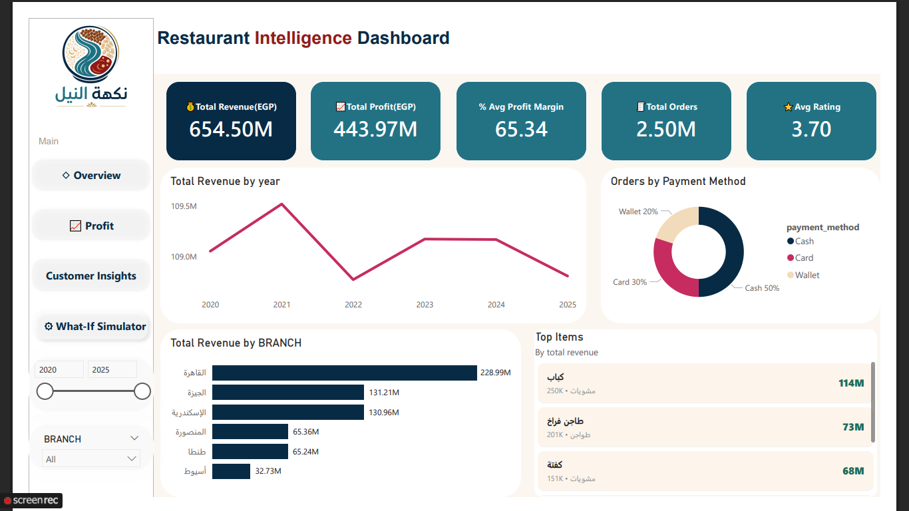
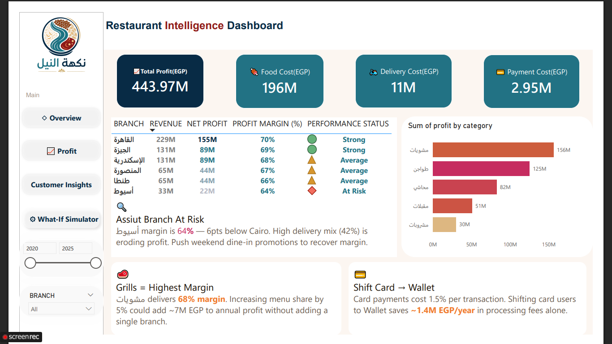
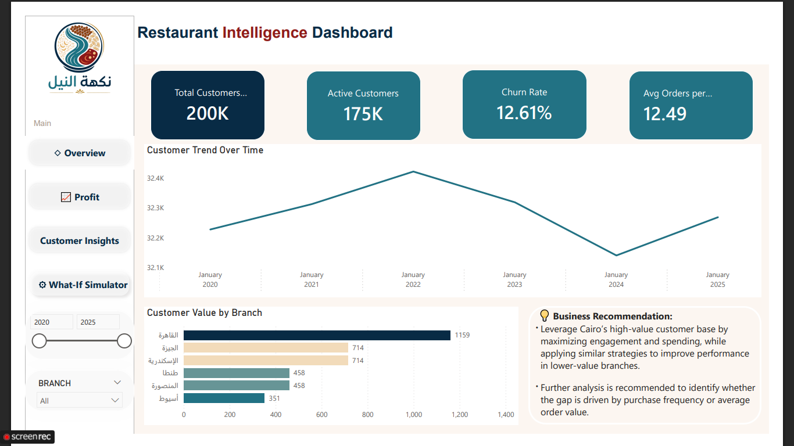
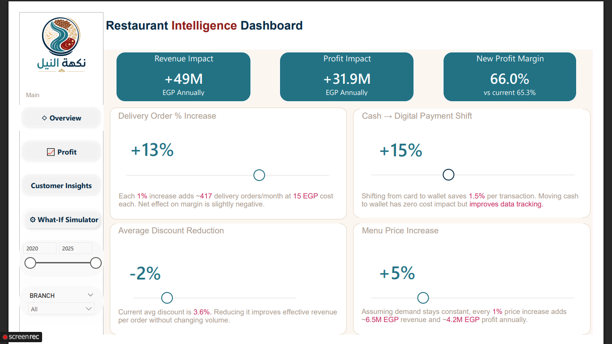
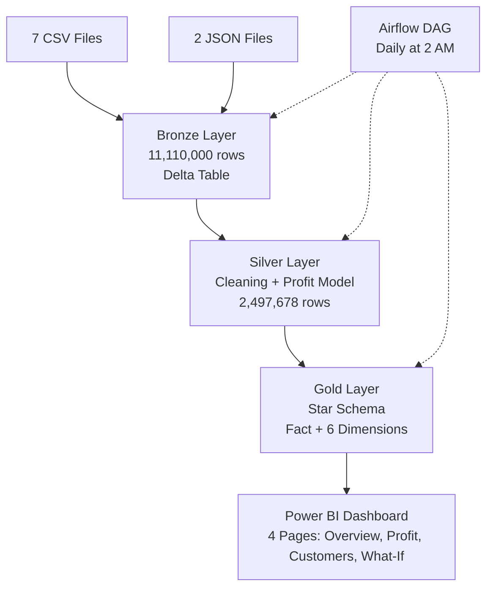

# 🍽️ Egyptian Restaurant Data Platform  
## End-to-End Medallion Architecture on Databricks (11.1M+ Records | 2020–2025)

> **A production-grade analytics system** simulating a multi-branch restaurant chain in Egypt.  
> Built entirely on **Databricks** (Spark + Delta Lake), orchestrated with **Apache Airflow**, and delivered through **Power BI**.

📌 **This is my Big Data project for the ITI Power BI Development Track – built to demonstrate enterprise-ready data engineering skills.**

---

## 📸 Dashboard Previews

| Page | Preview |
|------|---------|
| Executive Overview |  |
| Profit Analysis |  |
| Customer Insights |  |
| What-If Simulator |  |


---

## 🎯 Why This Project Matters

This isn't just a dashboard. It's a **complete data platform** that:

- Processes **11.1M+ raw records** from 9 disparate files (7 CSV + 2 JSON)
- Runs a **Medallion Architecture** (Bronze → Silver → Gold) entirely on Databricks
- Uses **PySpark** for distributed data transformation
- Stores everything in **Delta Lake** for ACID compliance and time travel
- Orchestrates daily runs with **Apache Airflow**
- Delivers **4 interactive Power BI pages** with profit modeling, what-if simulation, and customer retention analysis


---

## 🧱 Databricks – The Heart of the Pipeline

### Why Databricks?

| Feature | How I Used It |
|---------|----------------|
| **Unified workspace** | All notebooks (Bronze, Silver, Gold) in one place |
| **Delta Lake** | ACID transactions, schema enforcement, time travel |
| **PySpark** | Distributed processing of 11M+ rows |
| **Auto-loader** | Incremental ingestion from cloud storage |
| **SQL Analytics** | Quick validation queries after each layer |
| **Cluster management** | Optimized for community edition |

### Databricks Notebooks (3)

**01_bronze_layer.ipynb**
- Input: 7 CSV + 2 JSON files
- Operations: `unionByName`, schema unification, Delta write
- Output: `bronze_restaurant` (11,110,000 rows)

**02_silver_layer.ipynb**
- Input: `bronze_restaurant`
- Operations: Deduplication (2M rows removed), price filter (51K rows removed), profit modeling (3 cost drivers), feature engineering (`time_of_day`, `is_weekend`, `year`, `quarter`)
- Output: `silver_restaurant` (2,497,678 rows)

**03_gold_layer.ipynb**
- Input: `silver_restaurant`
- Operations: Create star schema (1 fact table + 6 dimension tables), enforce relationships, validate referential integrity
- Output: `gold_fact_orders` + `dim_date`, `dim_branch`, `dim_category`, `dim_customer`, `dim_payment`, `dim_time`

### Databricks SQL Examples

```sql
-- Bronze: Unified ingestion
CREATE OR REPLACE TABLE bronze_restaurant
USING DELTA
AS SELECT * FROM csv.`/path/restaurants`
UNION ALL
SELECT * FROM json.`/path/orders`;

-- Silver: Deduplication with window function
CREATE OR REPLACE TABLE silver_restaurant AS
SELECT * FROM (
    SELECT *,
        ROW_NUMBER() OVER (PARTITION BY order_id ORDER BY order_date) as rn
    FROM bronze_restaurant
) WHERE rn = 1;

-- Silver: Add profit column (calculated during query)
CREATE OR REPLACE TABLE silver_restaurant_with_profit AS
SELECT *,
    total_amount - 
    (total_amount * 0.30) - 
    CASE WHEN order_type = 'Delivery' THEN 15 ELSE 0 END - 
    CASE WHEN payment_method = 'Card' THEN total_amount * 0.015 ELSE 0 END AS profit
FROM silver_restaurant;

## 📐 Complete Architecture



⚙️ Airflow DAG – Production Orchestration
Located in: restaurant_pipeline_dag.py
┌──────────────┐
│   start_task │
└──────┬───────┘
       ▼
┌──────────────┐
│ ingest_bronze│  ← Load 9 files → Delta table
└──────┬───────┘
       ▼
┌──────────────┐
│ clean_silver │  ← Dedupe, filter, profit calc
└──────┬───────┘
       ▼
┌──────────────┐
│  build_gold  │  ← Star schema (fact + dims)
└──────┬───────┘
       ▼
┌──────────────┐
│ data_quality │  ← Validate row counts & nulls
└──────┬───────┘
       ▼
┌──────────────┐
│notify_success│  ← Slack webhook alert
└──────┬───────┘
       ▼
┌──────────────┐
│   end_task   │
└──────────────┘

Configuration	Value
Schedule	0 2 * * * (daily 2 AM)
Retries	3 attempts (5-minute delay)
Timeout	60 minutes
Alerting	Slack webhook (success/failure)
Catchup	False
💰 Profit Modeling (Silver Layer)
Since actual cost data wasn't available, I built a deterministic financial model directly in PySpark:

Cost Driver	Assumption	Annual Impact
Food cost	30% of revenue	~196M EGP
Delivery cost	15 EGP per delivery order	~11M EGP
Card processing fee	1.5% of card transactions	~2.95M EGP
Result: Average profit margin = 65.34% (consistent with Egyptian QSR benchmarks)

📊 Power BI Dashboard – 4 Pages
Page 1: Executive Overview
Purpose: At-a-glance business health

KPI cards: Revenue (654.5M), Profit (444M), Margin (65.34%), Orders (2.5M), Rating (3.70)

Revenue trend by year (2020–2025)

Revenue by branch (Cairo #1)

Top 5 items by revenue

Payment method distribution

Data quality snapshot – 8.6M rows removed, 99.5% trust score

Page 2: Profit Analysis
Purpose: Branch-level profitability and actionable insights

Branch performance table with margin grading (Strong / Average / At Risk)

Actionable insights:

"Assiut margin is 64% — 6pts below Cairo. High delivery mix (42%) is eroding profit. Push weekend dine-in promotions."

"Grills deliver 68% margin. Increasing menu share by 5% could add ~7M EGP to annual profit."

"Card payments cost 1.5%. Shifting card users to Wallet saves ~1.4M EGP/year."

Branch Data Summary:

Branch	Revenue	Net Profit	Margin	Status
القاهرة	229M	155M	70%	Strong
الجيزة	131M	89M	69%	Strong
الإسكندرية	131M	89M	68%	Average
المنصورة	65M	44M	67%	Average
طنطا	65M	44M	66%	Average
أسيوط	33M	22M	64%	At Risk
Page 3: Customer Insights
Purpose: Understand customer behavior, lifetime value, and retention drivers

KPI cards: Total Customers (200K), Active Customers (175K), Churn Rate (12.6%), Avg Orders per Customer (12.49)

CLV (Customer Lifetime Value) by branch (horizontal bar chart): Cairo (1,159 EGP), Assiut (351 EGP)

Customer segmentation (Donut chart): New (0.4%), Regular (1.5%), Loyal (98.1%)

Business recommendations:

"Cairo customers have 3.2x higher lifetime value than Assiut. Investigate frequency vs order value."

"98.1% loyal customers – launch VIP referral program."

"12.6% churn rate – target at-risk branches with win-back offers."

Customer Measures (DAX):

dax
Total Customers = DISTINCTCOUNT(Fact_Orders[customer_id])
Active Customers = CALCULATE(DISTINCTCOUNT(Fact_Orders[customer_id]), Fact_Orders[order_date] >= DATE(2025,1,1))
Churn Rate = DIVIDE([Total Customers] - [Active Customers], [Total Customers], 0)
Avg Orders per Customer = DIVIDE(COUNTROWS(Fact_Orders), [Total Customers], 0)
CLV = DIVIDE([Total Revenue], [Total Customers], 0)
Page 4: What-If Simulator
Purpose: Interactive scenario analysis for strategic decisions

Parameter	Default	Business Impact
Delivery Order % Increase	+13%	Each 1% adds ~417 orders/month. Net effect slightly negative on margin.
Cash → Digital Payment Shift	+15%	Shifting card to wallet saves 1.5% per transaction.
Average Discount Reduction	-2%	Current discount 3.6%. Reducing improves revenue per order.
Menu Price Increase	+5%	Every 1% adds ~6.5M revenue and ~4.2M profit annually.
Combined Impact:

Revenue Impact: +49M EGP annually

Profit Impact: +31.9M EGP annually

New Profit Margin: 66.0% (vs current 65.3%)

📈 Data Quality Results
Stage	Records
Raw ingestion (Bronze)	11,110,000
After duplicate removal	9,110,000
After price filter	9,058,558
After joins (Gold)	2,497,678
Quality gates enforced:

Duplicate detection (ROW_NUMBER() window)

Price validation (negative/zero removal)

Schema enforcement across all 9 sources

Referential integrity (fact → dim keys)

Null handling (explicit defaults)

🛠️ Complete Tech Stack
Layer	Technology	Why
Data Lake	Delta Lake (Databricks)	ACID, time travel, schema enforcement
Processing	Apache Spark (PySpark)	Distributed 11M+ row processing
Orchestration	Apache Airflow	Production scheduling, retries, alerts
BI & Analytics	Power BI	Interactive dashboards, what-if parameters
Languages	Python, SQL, DAX	End-to-end control
Version Control	GitHub	Portfolio-ready
📁 Repository Structure
text
Egyptian-Restaurant-Platform/
│
├── assets/                      # Dashboard screenshots
│   ├── overview.png
│   ├── profit-analysis.png
│   ├── customer-insights.png
│   └── what-if-simulator.png
│
├── notebooks/                   # Databricks notebooks
│   ├── 01_bronze_layer.ipynb
│   ├── 02_silver_layer.ipynb
│   └── 03_gold_layer.ipynb
│
├── airflow/
│   └── restaurant_pipeline_dag.py
│
├── powerbi/
│   └── restaurant_dashboard.pbix
│
├── README.md
└── requirements.txt
🚀 How to Reproduce (Data Engineering Focus)
1. Databricks Setup
Import 3 notebooks into Databricks workspace

Mount source files (CSV + JSON) to DBFS

Run 01_bronze_layer → 02_silver_layer → 03_gold_layer sequentially

Verify row counts at each stage

Export Gold tables as Parquet

2. Airflow Deployment
Copy restaurant_pipeline_dag.py to ~/airflow/dags/

Configure Slack webhook for alerts

Start scheduler: airflow scheduler

Trigger DAG: airflow dags trigger restaurant_medallion_pipeline

3. Power BI
Open restaurant_dashboard.pbix

Connect to exported Gold tables

Publish to Power BI Service

🧠 Data Engineering Highlights
Capability	Implementation
Scalability	PySpark distributed processing (11M+ rows)
Idempotency	Delta Lake MERGE / overwrite-safe operations
Data Quality	Deduplication, null handling, referential integrity
Orchestration	Airflow DAG with retries and Slack alerts
Immutability	Bronze → Silver → Gold with time travel
Star Schema	Fact + 6 dimensions for BI optimization
Profit Modeling	3 cost drivers embedded in PySpark
Simulation Layer	Power BI what-if parameters
📊 Business KPIs (Final)
Metric	Value
Total Revenue	654.5M EGP
Total Profit	444.0M EGP
Average Profit Margin	65.34%
Average Order Value	262 EGP
Average Rating	3.70 / 5
Total Clean Orders	2,497,678
Date Range	2020 – 2025
Branches	6 (Cairo, Giza, Alexandria, Mansoura, Tanta, Assiut)
👩‍💻 Author
Yasmeen El Shamy
ITI – Power BI Development Track
Big Data Project – Job Portfolio

GitHub: @Yasmeen327

Focus: Data Engineering, Analytics Systems, BI Architecture

📌 This project is my ticket to a data engineering or BI role. Every line of code, every visual, and every insight was built with production standards in mind.

📜 License
MIT License – free for educational and professional use with attribution.


