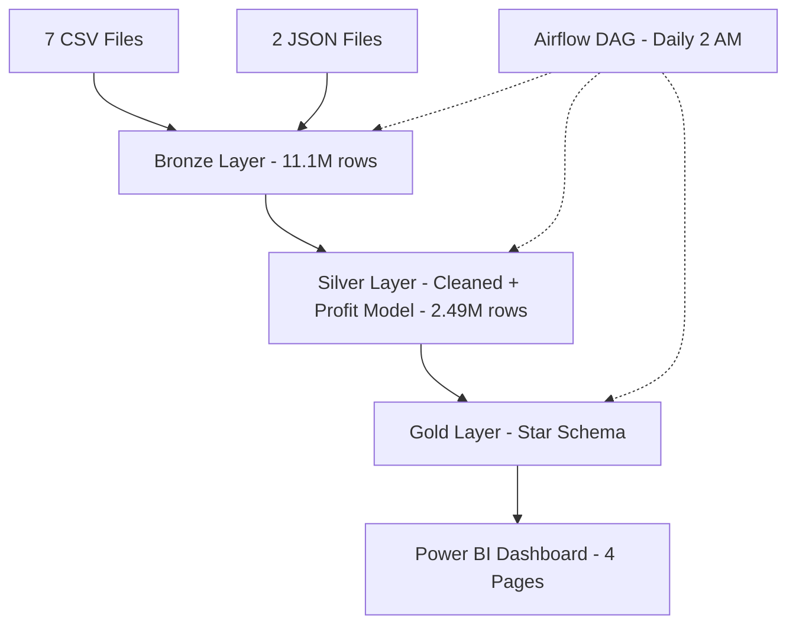

# 🍽️ Egyptian Restaurant Data Platform  
## End-to-End Medallion Architecture on Databricks (11.1M+ Records | 2020–2025)

> A production-grade analytics system simulating a multi-branch restaurant chain in Egypt.  
> Built entirely on **Databricks** (Spark + Delta Lake), orchestrated with **Apache Airflow**, and delivered through **Power BI**.

This is my Big Data project for the ITI Power BI Development Track – built to demonstrate enterprise-ready data engineering skills.

---

# 📊 Dashboard Previews

## Executive Overview

## Profit Analysis

## Customer Insights

## What-If Simulator

---

# 🚀 Why This Project Matters

This isn't just a dashboard. It's a complete data platform that:

- Processes **11.1M+ records** from 9 heterogeneous sources (7 CSV + 2 JSON)
- Implements **Medallion Architecture (Bronze → Silver → Gold)**
- Uses **PySpark for distributed transformations**
- Stores data in **Delta Lake (ACID + time travel)**
- Orchestrates workflows using **Apache Airflow**
- Delivers **interactive Power BI dashboards with simulation capabilities**

---

## 🧱 Complete Architecture

🧊 Databricks – The Core Processing Layer
Notebooks Overview
01_bronze_layer.ipynb
Ingest 7 CSV + 2 JSON files
Schema unification using unionByName
Stored as Delta table

Output:
bronze_restaurant (11,110,000 rows)

02_silver_layer.ipynb
Deduplication (~2M rows removed)
Invalid price filtering (51K rows removed)
Feature engineering:
time_of_day, year, quarter, is_weekend
Profit modeling (3 cost drivers)

Output:
silver_restaurant (2,497,678 rows)

03_gold_layer.ipynb
Star schema creation:
1 fact table
6 dimension tables
Relationship enforcement
Optimized for Power BI

Output:
gold_fact_orders + dimension tables

Example SQL
-- Deduplication
SELECT * FROM (
    SELECT *,
           ROW_NUMBER() OVER (PARTITION BY order_id ORDER BY order_date) AS rn
    FROM bronze_restaurant
)
WHERE rn = 1;
⚙️ Airflow Orchestration

DAG: restaurant_pipeline_dag.py

Pipeline Flow

start → ingest_bronze → clean_silver → build_gold → data_quality → notify → end

Configuration
Setting	Value
Schedule	Daily at 02:00 AM
Retries	3
Delay	5 minutes
Timeout	60 minutes
Alerts	Slack
💰 Profit Modeling (Silver Layer)
Cost Driver	Assumption
Food Cost	30%
Delivery Cost	15 EGP per order
Card Fee	1.5%

Result:
Average profit margin = 65.34%

📊 Power BI Dashboard
Page 1 — Executive Overview
Revenue: 654.5M EGP
Profit: 444M EGP
Margin: 65.34%
Orders: 2.5M
Revenue trends and top products
Page 2 — Profit Analysis
Branch performance comparison
Margin segmentation
Key insights:
Assiut underperforming (64%)
Grill category high margin (68%)
Page 3 — Customer Insights
Customers: 200K
Churn: 12.6%
CLV analysis
Segmentation (New / Regular / Loyal)
Page 4 — What-If Simulator
Delivery ratio adjustment
Pricing strategy
Discount optimization

Impact:

+49M EGP revenue
+31.9M EGP profit
Margin: 66.0%
🧪 Data Quality Results
Stage	Records
Bronze	11,110,000
After Dedup	9,110,000
After Cleaning	2,497,678
Quality Controls
Deduplication using window functions
Price validation
Schema enforcement
Referential integrity
🛠️ Tech Stack
Layer	Technology
Storage	Delta Lake
Processing	Apache Spark
Orchestration	Apache Airflow
BI	Power BI
Languages	Python, SQL, DAX
📁 Repository Structure
Egyptian-Restaurant-Platform/
├── assets/
├── notebooks/
├── airflow/
├── powerbi/
├── README.md
└── requirements.txt
🚀 How to Run
Databricks
Run Bronze → Silver → Gold notebooks
Airflow
Deploy DAG
Start scheduler
Power BI
Connect to Gold tables
Refresh dataset
🧠 Engineering Highlights
Scalable PySpark processing (11M+ records)
Medallion architecture implementation
Airflow production-style orchestration
Star schema for BI optimization
Integrated financial modeling
👤 Author

Yasmeen El Shamy
GitHub: @Yasmeen327

📜 License

MIT License
